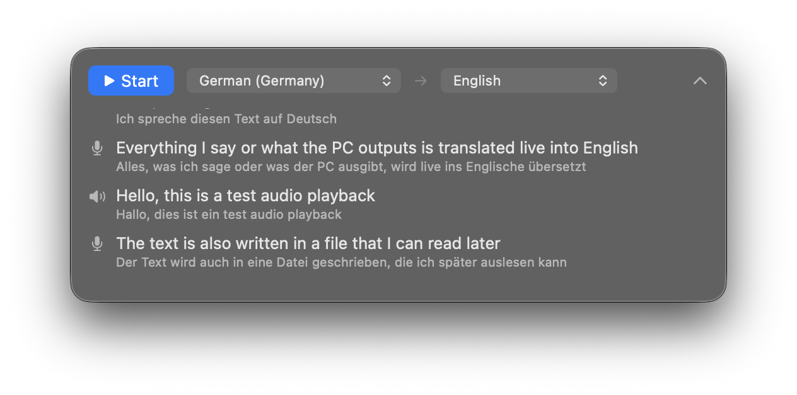
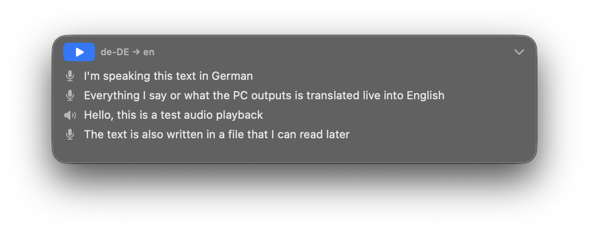

# LiveTranslate

Floating, translucent macOS app that captures **your microphone *and* the
audio your Mac is playing** at the same time, transcribes them on-device
(or via Apple's server fallback), and translates the result into the
target language of your choice — all in one rolling, hover-able window.

Built with SwiftPM and a CMake-driven dependency on
[whisper.cpp](https://github.com/ggerganov/whisper.cpp) — no Xcode project required.





## Build & run

```sh
./build.sh
open build/LiveTranslate.app
```

Prerequisites:
- Apple Command Line Tools (`xcode-select --install`).
- CMake (`brew install cmake`). Used once on first build to compile
  whisper.cpp; cached after.

The first run of `./build.sh` clones whisper.cpp v1.7.4 into `external/`,
builds it into static libraries under `build/whisper-prefix/`, and
downloads the bundled `ggml-base-q5_1.bin` model (~57 MB) into
`build/whisper-models/`. The model is then copied into the `.app`'s
`Contents/Resources/` so the user doesn't need to fetch it separately.
The first build takes ~60-90 seconds. Subsequent builds skip these
steps and complete in a few seconds.

## ⚠️ One-time setup: translation language pack

Apple's `Translation` framework only downloads language pairs **on
demand**. Do this *before* the first run or the translation panel will
stay empty:

Open **System Settings → Apple Intelligence & Siri → Translation
Languages** (or, on slightly older macOS, **System Settings → General →
Language & Region → Translation Languages**) and add both your source
and target languages.

Transcription itself doesn't need any system download — whisper.cpp
runs against a model bundled inside the app. Just pick the source
language in the UI and start talking.

To use a larger / different whisper model, drop a GGML `.bin` named
`ggml-base-q5_1.bin` into `~/Documents/LiveTranslate/models/` — the app
picks that up in preference to the bundled default. Grab alternatives
(tiny, small, medium, large variants — quantized or full-precision)
from <https://huggingface.co/ggerganov/whisper.cpp>.

## Permissions

First launch prompts for:
- **Microphone** — to capture your voice.
- **Screen Recording** — required by `ScreenCaptureKit` to access system
  audio. No screen frames are kept; only the audio stream is used.

(Speech Recognition permission is no longer needed — Apple's Speech
framework isn't in the pipeline anymore.)

## How it works (one-paragraph version)

The mic feeds an `AVAudioEngine` tap; system audio comes from
`ScreenCaptureKit` (audio-only configuration). Each stream stays
independent — both are 48 kHz mono Float32, each goes through its
**own** copy of [xiph/rnnoise](https://github.com/xiph/rnnoise) (a tiny
GRU-based denoiser, BSD 3-clause), then each is downsampled to 16 kHz
and fed to [whisper.cpp](https://github.com/ggerganov/whisper.cpp) in
chunks (closed at silence or after 5 s). The two streams share one
whisper model + a mutex around `whisper_full`, so they're transcribed
in chunk-arrival order without contention. Recognized sentences are
translated per-sentence via Apple's `Translation` framework and tagged
with their source stream in the UI (faint warm tint = mic, faint cool
tint = system). Old sentences eventually drop into a per-run JSONL
archive paired with per-stream `.wav` + `.srt` files:

```
~/Documents/LiveTranslate/
    transcripts/<stamp>.jsonl                       (mic + system interleaved, "source" field)
    transcripts/<stamp>.mic.<src>.srt              (mic subtitles, source language)
    transcripts/<stamp>.mic.<tgt>.srt              (mic subtitles, translated)
    transcripts/<stamp>.system.<src>.srt           (system subtitles, source language)
    transcripts/<stamp>.system.<tgt>.srt           (system subtitles, translated)
    recordings/<stamp>.mic.wav                     (post-denoise mic, 48 kHz mono)
    recordings/<stamp>.system.wav                  (post-denoise system, 48 kHz mono)
```

The `.srt` files use cue times relative to the start of the matching
`.wav`, so you can drop them straight into a video player along with
the audio. They're also plain text — `grep -i term *.srt` works.

## Reviewing a run

You usually want both streams playing simultaneously and one merged
subtitle track per language. Two steps:

**Step 1: merge SRTs.** `tools/merge-srt.py` reads the two per-source
SRTs and interleaves them into one, tagging each cue with `[Mic]` or
`[Sys]` so the speaker is obvious:

```sh
STAMP=2026-05-17_13-46-19   # ← change to the run you want
REPO=/path/to/live-translate   # ← wherever you cloned this repo
cd ~/Documents/LiveTranslate

"${REPO}/tools/merge-srt.py" \
    "transcripts/${STAMP}.mic.de.srt" "transcripts/${STAMP}.system.de.srt" \
    "transcripts/${STAMP}.de.srt"
"${REPO}/tools/merge-srt.py" \
    "transcripts/${STAMP}.mic.en.srt" "transcripts/${STAMP}.system.en.srt" \
    "transcripts/${STAMP}.en.srt"
```

**Step 2: build the MKV.** ffmpeg's `amix` filter sums the two WAVs at
the same wall-clock rate (both start at the run's t=0). Both merged
subtitle tracks embed; toggle in your player's *Subtitle → Sub Track*
menu:

```sh
ffmpeg -y \
  -f lavfi -i color=c=black:s=960x180:r=2 \
  -i "recordings/${STAMP}.mic.wav" \
  -i "recordings/${STAMP}.system.wav" \
  -i "transcripts/${STAMP}.de.srt" \
  -i "transcripts/${STAMP}.en.srt" \
  -filter_complex "[1:a][2:a]amix=inputs=2:normalize=0[aout]" \
  -map 0:v -map "[aout]" -map 3 -map 4 \
  -c:v libx264 -preset ultrafast -tune stillimage \
  -c:a aac -c:s srt \
  -metadata:s:s:0 language=deu \
  -metadata:s:s:1 language=eng \
  -disposition:s:0 default \
  -shortest "${STAMP}.mkv"
```

Adjust the two `language=` codes (`deu`, `eng`, `fra`, `spa`, `nld`…)
to match your actual source/target. `normalize=0` keeps mic and system
at their original loudness; switch to `=1` if one dominates the mix.

If you want subtitles **burned in** (one fixed language, playable in
any tool that can't toggle tracks):

```sh
ffmpeg -y \
  -f lavfi -i color=c=black:s=960x180:r=10 \
  -i "recordings/${STAMP}.mic.wav" \
  -i "recordings/${STAMP}.system.wav" \
  -filter_complex "[1:a][2:a]amix=inputs=2:normalize=0[aout]" \
  -vf "subtitles=filename=transcripts/${STAMP}.en.srt" \
  -map 0:v -map "[aout]" \
  -c:v libx264 -preset ultrafast -tune stillimage -c:a aac \
  -shortest "${STAMP}.en.mp4"
```

(`subtitles=` requires an ffmpeg built with libass — the Homebrew
default. If you see *"No such filter: 'subtitles'"*, `brew reinstall
ffmpeg`.)

See [CLAUDE.md](CLAUDE.md) for full architectural notes, the things
that have bitten us, and the file-by-file map.

## Debug log

```sh
tail -f /tmp/livetranslate.log
```
